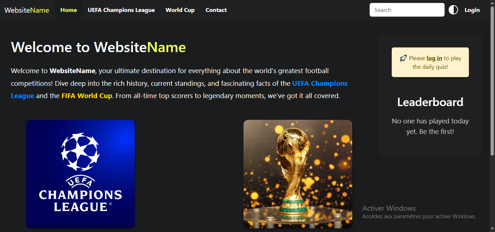
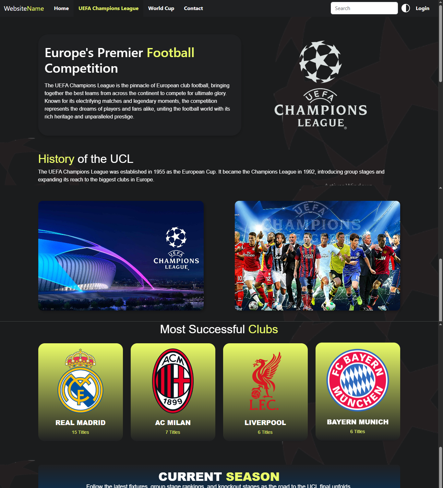
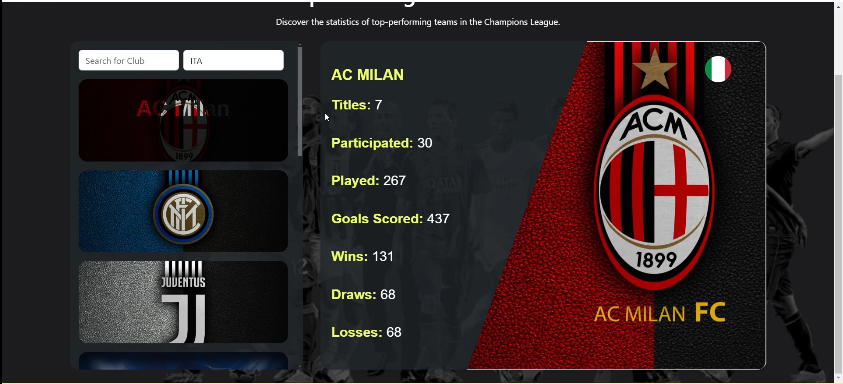

# FootHall Angular Web Application

FootHall is a modular Angular 18 web application offering quizzes, historical facts, club details, team performance stats, and more—powered by a simple mock backend.

## 🚀 Features

- 🔐 **Authentication** (login form, route guards)  
- 🕰️ **On This Day** historical facts widget  
- ❓ **Quiz Module** with dynamic questions  
- ⚽ **Club Details** (e.g. UCL teams)  
- 📊 **Team Performance** charts & stats  
- 🏆 **World Cup (WC)** historical data  
- ✉️ **Contact Form** with validations  
- 📂 **CSV Import** via PapaParse  
- 🖥️ **Mock Backend** (`server.ts`) for API endpoints  

## 📁 Project Structure

```
/src
  /app
    /components      # Reusable Angular UI components
    /services        # HTTP & data services
    /pages           # Routed views (home, quiz, contact, club-details, stats)
  /assets            # Static images & styles
/server              # Mock API server (Express)
/angular.json       # Angular workspace config
/package.json       # NPM scripts & dependencies
/tsconfig.json      # TypeScript config
```

## ⚽ UCL (UEFA Champions League) Module

This module provides detailed information about various clubs participating in the Champions League, including:

- Team names and logos
- Historical performance
- Match statistics and scores
- Interactive data visualizations

## 🏆 World Cup (WC) Module

A dedicated section displaying historical data and details from past World Cup tournaments:

- Old match records
- Winning teams and scores
- Notable moments and players

## 🛠 Tech Stack

- **Angular 18** + Angular CLI  
- **TypeScript** & **RxJS**  
- **Tailwind CSS**  
- **PapaParse** (CSV parsing)  
- **Node.js** / **Express** (mock backend)

## 📷 Screenshots

### Home Page


### UCL page


### Performance teams


### World Cup Page


## 📦 Getting Started

1. **Clone** the repo  
   ```bash
   git clone https://github.com/AlaBhs/Angular_Project.git
   cd Angular_Project
   ```

2. **Install** dependencies  
   ```bash
   npm install
   ```

3. **Run** the mock backend  
   ```bash
   node server.ts
   ```

4. **Serve** the Angular app  
   ```bash
   ng serve
   ```

5. **Open** your browser  
   ```
   http://localhost:4200
   ```

## 📝 Available Scripts

- `npm run start` / `ng serve` — development server  
- `npm run build` — production build  
- `npm run lint` — lint code  
- `npm run test` — run unit tests  

## 👨‍💻 Authors

**AlaBhs** — [github.com/AlaBhs](https://github.com/AlaBhs)
**NouiraTaher** — [github.com/NouiraTaher](https://github.com/NouiraTaher)
**habibst1** — [github.com/habibst1](https://github.com/habibst1)

MIT License © 2025
